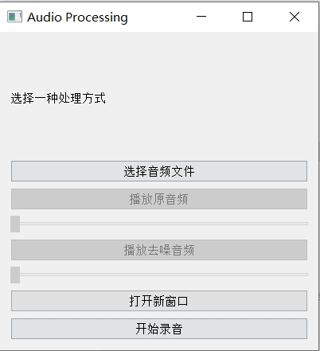
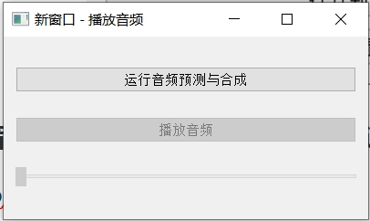

## 运行程序

#### 方式一：获得定制化的模型进行合成

1.运行model_prediction/code/model/model.py文件训练模型

2.运行run.py进行预测和合成

#### 方式二：直接运行

直接运行run.py文件

## 音频合成

#### 1. 可以直接选择音频文件，若没有音频文件，可选择

a 自带的test_vedio.wav

b 点击开始录音获得60s音频

**可点击播放原音频和播放去噪音频**

#### 2. 点击打开新窗口可获得合成后的音频

## 系统架构

|——model_prediction

|	|——code

|	|	|——model

|	|	|	|——data_utils.py:待训练和待预测的数据预处理

|	|	|	|——model.py：模型的初始化、训练、保存

|	|	|	|——predict.py：预测

|	|	|——utils

|	|	|	|——record_audio.py：录制音频

|	|	|	|——voice_segment.py：音频分割

|	|——data：待训练的数据集

|——wav_document_wav：所有背景音乐

|——classifier.py：对音频进行分类和整合

|——denoiserbyhand.py：手动进行数据降噪

|——mix.py：背景音乐和说话音频的融合

|——plot.py：绘制降噪前后音频

|——run.py：运行主程序

|——test_vedio.wav